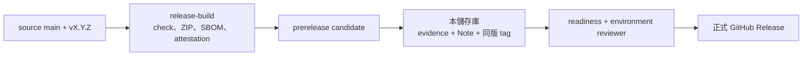

# AI Dev Platform Release

本儲存庫只保存已核准版本的 Release Note、發行證據與 Git tag。平台原始碼在 `ai_dev_platform-cicd-platform`；ZIP、SHA-256、SPDX SBOM 與 Sigstore attestation bundle 保存在來源 repository 的 GitHub Releases。

## 資料流



## 儲存庫邊界

允許：

- `release-evidence/<version>.json`
- `release-notes/<version>.md`
- `v<MAJOR>.<MINOR>.<PATCH>` annotated tag
- `.github/`、`.gitlab/`、`scripts/manage_collaborators.py` 等 repository 管理檔

禁止：

- 平台或產品原始碼；
- ZIP、APK、AAB、BIN、ELF、韌體映像；
- 實體簽章、attestation、SBOM、provenance 或金鑰；
- `.env`、Token、CI 工作目錄、`build/`、`dist/`、`artifacts/`。

## 後續正式發布

`v1.5.0` 已完成第一份正式 GitHub Release。下列流程適用於後續版本；先把 `X.Y.Z` 換成 source `distribution/manifest.json` 的版本，而且必須等 source PR 合併與所有 required checks 通過後才執行。

### 1. 在 source 建 candidate

```bash
cd ../ai_dev_platform-cicd-platform
RELEASE_VERSION=X.Y.Z
git switch main
git pull --ff-only origin main
test -z "$(git status --porcelain)"
git tag -a "v${RELEASE_VERSION}" -m "release: v${RELEASE_VERSION}"
git push origin "v${RELEASE_VERSION}"
```

`release-build` environment 由來源作者以外的人核准。完成後下載並驗證：

```bash
RELEASE_VERSION=X.Y.Z
RELEASE_MATERIALS_DIR="$(mktemp -d)"
gh release download "v${RELEASE_VERSION}" \
  --repo JiaChangGit/ai_dev_platform-cicd-platform \
  --dir "$RELEASE_MATERIALS_DIR"
(
  cd "$RELEASE_MATERIALS_DIR"
  sha256sum -c "ai-dev-platform-${RELEASE_VERSION}.zip.sha256"
  gh attestation verify "ai-dev-platform-${RELEASE_VERSION}.zip" \
    -R JiaChangGit/ai_dev_platform-cicd-platform
)
```

此時 GitHub Release 應為 prerelease candidate，不是正式版。

### 2. 準備 evidence 與 Release Note

回到本儲存庫，從最新 `main` 建分支：

```bash
cd ../ai_dev_platform-release
RELEASE_VERSION=X.Y.Z
RELEASE_BRANCH="release/${RELEASE_VERSION}"
EVIDENCE_FILE="release-evidence/${RELEASE_VERSION}.json"
NOTE_FILE="release-notes/${RELEASE_VERSION}.md"
SOURCE_REPO=../ai_dev_platform-cicd-platform

git switch main
git pull --ff-only origin main
git switch -c "$RELEASE_BRANCH"
```

依 `release-evidence/README.md` 與 `release-notes/README.md` 建立兩個檔案。Evidence 的 URI、hash、source commit、source ref、CI run、attestation repository／workflow、SBOM、provenance、核准者與發布者都必須來自本次 candidate；不要先填示範值。

```bash
python3 -B ../ai-dev-platform/scripts/verify_release_layout.py .
python3 -B ../ai-dev-platform/scripts/verify_release_evidence.py "$EVIDENCE_FILE"
python3 -B scripts/manage_collaborators.py check
git diff --check
git add "$EVIDENCE_FILE" "$NOTE_FILE"
git commit -m "chore(release): prepare v${RELEASE_VERSION}"
git push -u origin "$RELEASE_BRANCH"
gh pr create --base main --head "$RELEASE_BRANCH" \
  --title "chore(release): prepare v${RELEASE_VERSION}" --fill
```

等待 `repository-policy`、`analyze-python` 與獨立核准通過後，以 rebase merge 保留發行分支的原子 commits。PR 分支不得建立正式 tag；核准後若又 push，必須重新取得 last-push approval。

### 3. 在 release main 建本機 tag 並跑 readiness

```bash
git switch main
git pull --ff-only origin main
test -z "$(git status --porcelain)"
git tag -a "v${RELEASE_VERSION}" -m "release: v${RELEASE_VERSION}"

ARTIFACT_FILE="$RELEASE_MATERIALS_DIR/ai-dev-platform-${RELEASE_VERSION}.zip"
SIGNATURE_FILE="$RELEASE_MATERIALS_DIR/ai-dev-platform-${RELEASE_VERSION}.provenance.sigstore.json"
SBOM_FILE="$RELEASE_MATERIALS_DIR/ai-dev-platform-${RELEASE_VERSION}.spdx.json"

python3 -B ../ai-dev-platform/scripts/verify_release_readiness.py . \
  --version "$RELEASE_VERSION" \
  --source-repo "$SOURCE_REPO" \
  --artifact-file "$ARTIFACT_FILE" \
  --signature-file "$SIGNATURE_FILE" \
  --sbom-file "$SBOM_FILE" \
  --provenance-file "$SIGNATURE_FILE"
```

Readiness 核對 release layout、evidence、Note、tag、來源 commit／ref、五項 CI、實體 SHA-256、attestation identity、SBOM、provenance 及核准者／發布者分離。它不會替發布者判斷 CI run 或人員身分是否真實，仍須在 GitHub 頁面確認。

通過後才推送 tag：

```bash
git push origin "v${RELEASE_VERSION}"
```

### 4. 推進正式版

從 source tag 啟動 promotion：

```bash
gh workflow run promote-release.yml \
  --repo JiaChangGit/ai_dev_platform-cicd-platform \
  --ref "v${RELEASE_VERSION}" \
  -f "version=${RELEASE_VERSION}"
```

`release-promotion` environment 再由發起者以外的人核准。Workflow 重新下載材料與本儲存庫同版 tag、再跑 readiness；通過後才把 candidate 改為正式 Latest Release。

## 證據驗證邊界

`verify_release_evidence.py` 只檢查 JSON schema、必要 checks 與欄位格式；`verify_release_readiness.py` 才讀取實體材料與 Git 狀態。兩者都不會任意連線檢查所有 URI，也不能證明成品沒有弱點。完整來源流程見 `../ai-dev-platform/docs/ci-cd-release.md`。

## GitHub 與 GitLab

GitHub 是 canonical source。`main` 必須經 PR、required checks、CODEOWNERS 與獨立核准；`v*` tag 不得 force 更新。GitLab Free 若建立本儲存庫的公開鏡像，只在 GitHub 合併或發布 tag 後手動推送：

```bash
git fetch origin --prune --tags
git switch main
git pull --ff-only origin main
git push gitlab main
git push gitlab --tags
```

不要在 GitLab 鏡像直接修改。本帳號目前尚未建立平台的兩個 GitLab project，建立與保護步驟見 `../ai-dev-platform/docs/repository-operations.md`。
