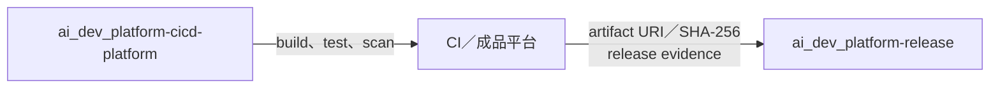

# AI Dev Platform Release

本儲存庫只保存發行中繼資料，不保存產品原始碼或建置成品。



## 允許內容

| 內容 | 位置 |
|---|---|
| 發行證據（release evidence） | `release-evidence/<version>.json` |
| Release Note | `release-notes/<version>.md` |
| 發行標記 | Git tag `v<MAJOR>.<MINOR>.<PATCH>` |
| 成品位置與摘要 | 發行證據內的 `artifact.uri`、`artifact.sha256` |

## 第一次連接遠端

本目錄使用獨立 `.git`，remote 固定為 Private repository `JiaChangGit/ai_dev_platform-release`。若需要從零重建，先建立同名空白遠端，不要預先建立 README、`.gitignore` 或 License；只有在 `.git` 不存在且遠端空白時，才執行：

```bash
git init -b main
git config user.name "Jia-Chang Chang"
git config user.email "108068508+JiaChangGit@users.noreply.github.com"
python3 -B ../ai-dev-platform/scripts/verify_release_layout.py .
git add -A
git diff --cached --check
git commit -m "chore: initialize release metadata repository"
git remote add origin git@github.com:JiaChangGit/ai_dev_platform-release.git
git push -u origin main
```

遠端若已有 commit，應重新 clone 後搬入允許的發行檔案，不得使用 force push 覆寫。

## 驗證

```bash
python3 ../ai-dev-platform/scripts/verify_release_layout.py .
python3 ../ai-dev-platform/scripts/verify_release_evidence.py release-evidence/<version>.json
```
