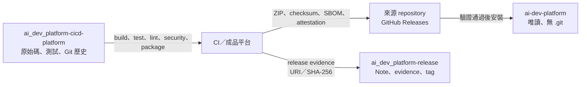
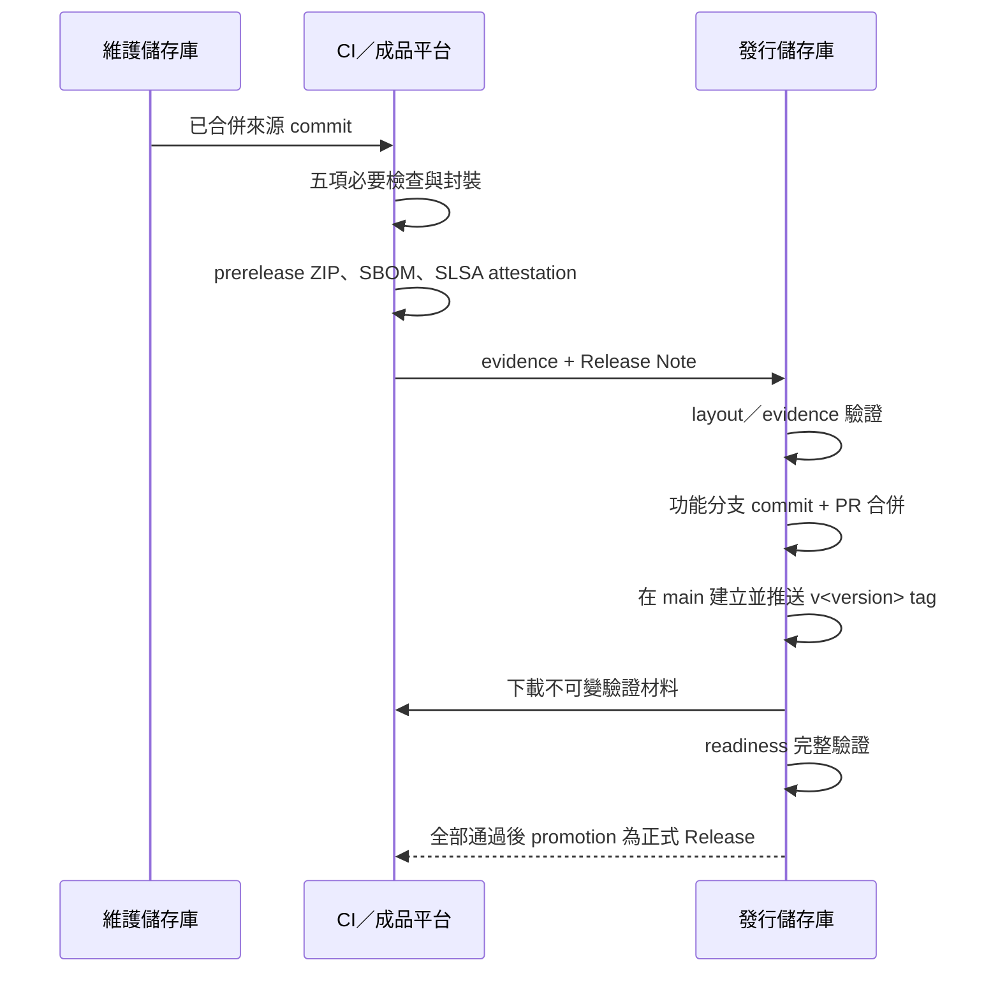

# AI Dev Platform Release

本儲存庫保存 AI Dev Platform 的發行中繼資料，不保存平台原始碼或建置成品。平台來源位於平行目錄 `ai_dev_platform-cicd-platform/`；ZIP、checksum、軟體物料清單（Software Bill of Materials, SBOM）與 GitHub/Sigstore SLSA attestation bundle 保存在來源 repository 的 GitHub Releases。

## 目錄與資料流

```text
Work/
├── ai-dev-platform/                   已安裝的唯讀平台
├── ai_dev_platform-cicd-platform/     平台維護來源
└── ai_dev_platform-release/           本儲存庫
```



## 允許內容

| 內容 | 位置 |
|---|---|
| 發行證據（release evidence） | `release-evidence/<version>.json` |
| Release Note | `release-notes/<version>.md` |
| 發行標記 | Git tag `v<MAJOR>.<MINOR>.<PATCH>` |
| 成品位置與摘要 | evidence 內的 `artifact.uri`、`artifact.sha256` |
| 儲存庫管理檔 | `.github/`、`.gitlab/`、`.gitlab-ci.yml`、`scripts/manage_collaborators.py` |

不得加入：

- 平台或產品原始碼
- `external/` 或第三方 skill
- ZIP、APK、AAB、BIN、ELF、韌體映像檔
- 實體簽章、SBOM、SLSA JSON 或公開／私密金鑰
- `.env`、Token、CI 工作目錄、`build/`、`dist/`、`artifacts/`

## 文件閱讀順序

| 情境 | 文件 |
|---|---|
| 第一次操作本儲存庫 | 本文件；依「正式發行流程」逐步執行 |
| 確認允許內容與禁止事項 | `AGENTS.md` |
| 撰寫 evidence | `release-evidence/README.md` 與 `../ai-dev-platform/docs/release-evidence.md` |
| 撰寫 Release Note | `release-notes/README.md` 與 `../ai-dev-platform/templates/release-note.md` |
| 新增 GitHub／GitLab 成員 | 本文件的「Collaborator 與審查政策」 |

若本文件與共用平台的 `workflow/release.md` 或驗證程式不一致，以共用平台目前版本與實際程式行為為準，並在同一個 PR 修正本文件。

## 正式發行流程



### 1. 確認來源與 CI

在維護儲存庫確認：

```bash
cd ../ai_dev_platform-cicd-platform
git status -sb
git log -1 --oneline
bash scripts/check.sh
python3 -B -m unittest discover -s tests -v
```

來源必須已合併到允許的 `main`、`release/*` 或發行 tag。CI 必須完成：

- `build`
- `test`
- `lint`
- `security`
- `package`

維護儲存庫的 `.github/workflows/check.yml` 會驗證平台來源、單元測試、封裝計畫與 Android 範例。來源 PR 合併後，擁有者在最新 `main` 建立 annotated `v<version>` tag；`.github/workflows/release.yml` 經 `release-build` environment 的獨立 reviewer 核准後，產生 ZIP、checksum、SPDX SBOM 與 keyless GitHub/Sigstore SLSA bundle，並建立 prerelease build candidate。不得把本機 dry-run 當成正式發行證據。

### 2. 設定版本並建立功能分支

以下以 `1.4.0` 示範。版本不同時只修改 `RELEASE_VERSION`。先回到本儲存庫，從遠端最新 `main` 建立功能分支：

```bash
cd ../ai_dev_platform-release
RELEASE_VERSION=1.4.0
RELEASE_BRANCH="agent/release-v${RELEASE_VERSION}"
EVIDENCE_FILE="release-evidence/${RELEASE_VERSION}.json"
NOTE_FILE="release-notes/${RELEASE_VERSION}.md"
SOURCE_REPO=../ai_dev_platform-cicd-platform

git switch main
git pull --ff-only origin main
git status -sb
git switch -c "$RELEASE_BRANCH"
```

### 3. 準備 evidence 與 Release Note

依共用平台範本建立：

```text
release-evidence/1.4.0.json
release-notes/1.4.0.md
```

Evidence 需記錄不可變來源 commit／tag、ZIP URI／SHA-256、Sigstore bundle URI／SHA-256、GitHub attestation repository／workflow／source ref、CI run、SBOM、SLSA、獨立核准者與發布者。`artifact.signatureAlgorithm` 使用 `github-attestation`，signature 與 provenance 指向同一份 bundle。Release Note 的第一行必須是包含相同 `v1.4.0` 的一級標題。

### 4. 驗證中繼資料並建立 PR

```bash
python3 -B ../ai-dev-platform/scripts/verify_release_layout.py .
python3 -B ../ai-dev-platform/scripts/verify_release_evidence.py \
  "$EVIDENCE_FILE"
python3 -B scripts/manage_collaborators.py check
git diff --check
git add "$EVIDENCE_FILE" "$NOTE_FILE"
git diff --cached --stat
git diff --cached --check
git commit -m "chore(release): prepare v${RELEASE_VERSION}"
git push -u origin "$RELEASE_BRANCH"

gh pr create \
  --draft \
  --base main \
  --head "$RELEASE_BRANCH" \
  --title "chore(release): prepare v${RELEASE_VERSION}" \
  --fill
```

`verify_release_evidence.py` 只驗證 JSON 契約、必要 check 名稱與欄位格式，不會讀取實體 ZIP、簽章、SBOM 或 SLSA。未安裝 GitHub CLI 時，可在 GitHub 網頁用剛推送的分支建立 PR。

建立 PR，等待 `repository-policy`、獨立核准與所有必要規則通過。功能分支不要建立或推送正式 tag；Squash merge 會建立新的 commit，正式 tag 必須指向合併後的 `main`。

### 5. 合併後建立本機 tag

```bash
git switch main
git pull --ff-only origin main
git status -sb
test "$(git rev-parse HEAD)" = "$(git rev-parse origin/main)"
git tag -a "v${RELEASE_VERSION}" -m "v${RELEASE_VERSION}"
```

若本機或遠端已存在同名 tag，停止操作並先確認該版本是否已發布；不得 force 更新。

### 6. 下載實體驗證材料

先建立儲存庫外的暫存目錄，並設定本次驗證使用的檔名：

```bash
RELEASE_MATERIALS_DIR="$(mktemp -d)"
ARTIFACT_FILE="$RELEASE_MATERIALS_DIR/ai-dev-platform-${RELEASE_VERSION}.zip"
SIGNATURE_FILE="$RELEASE_MATERIALS_DIR/ai-dev-platform-${RELEASE_VERSION}.provenance.sigstore.json"
SBOM_FILE="$RELEASE_MATERIALS_DIR/ai-dev-platform-${RELEASE_VERSION}.spdx.json"
PROVENANCE_FILE="$SIGNATURE_FILE"
```

從 evidence 指向的來源 repository GitHub Release，將 ZIP、SBOM 與 attestation bundle 下載到上述路徑。不要把這些檔案複製進本儲存庫：

```bash
gh release download "v${RELEASE_VERSION}" \
  --repo JiaChangGit/ai_dev_platform-cicd-platform \
  --dir "$RELEASE_MATERIALS_DIR" \
  --pattern "ai-dev-platform-${RELEASE_VERSION}.zip" \
  --pattern "ai-dev-platform-${RELEASE_VERSION}.spdx.json" \
  --pattern "ai-dev-platform-${RELEASE_VERSION}.provenance.sigstore.json"
```

下載後先確認路徑：

```bash
test -f "$ARTIFACT_FILE"
test -f "$SIGNATURE_FILE"
test -f "$SBOM_FILE"
test -f "$PROVENANCE_FILE"
```

### 7. 執行完整 readiness 關卡

```bash
python3 -B ../ai-dev-platform/scripts/verify_release_readiness.py . \
  --version "$RELEASE_VERSION" \
  --source-repo "$SOURCE_REPO" \
  --artifact-file "$ARTIFACT_FILE" \
  --signature-file "$SIGNATURE_FILE" \
  --sbom-file "$SBOM_FILE" \
  --provenance-file "$PROVENANCE_FILE"
```

此關卡會檢查：

1. evidence 檔名、JSON 版本、Release Note 與 tag 一致。
2. 本儲存庫工作樹乾淨，tag 指向 HEAD，目錄符合允許清單。
3. source commit 屬於 evidence 指定的 ref。
4. ZIP、簽章、SBOM、SLSA 的 SHA-256 與 evidence 一致。
5. `gh attestation verify` 固定 GitHub repository、workflow、來源 commit／ref 與 SLSA predicate，且拒絕 self-hosted runner 簽署身分。
6. SBOM 是 SPDX 2.x 或 CycloneDX JSON，GitHub attestation bundle hash 與 SLSA predicate type 正確。
7. Evidence 宣告的五項必要 CI check 都存在，核准者與發布者字串不同。

Readiness 會透過 GitHub CLI 驗證 attestation，但不會自行判定 evidence 中的核准者是否為有效的獨立人員。發布者仍須在 GitHub 確認來源 run 成功、environment 與 PR 核准紀錄有效。

### 8. 推送 tag 並發布

```bash
git push origin "v${RELEASE_VERSION}"
```

只有第 7 步 readiness 通過後才能推送 release metadata tag。Evidence／Note 已經由 PR 合併到 `main`，不需要再直接推送 `main`。接著從同一來源 tag 啟動受保護的 promotion workflow：

```bash
gh workflow run promote-release.yml \
  --repo JiaChangGit/ai_dev_platform-cicd-platform \
  --ref "v${RELEASE_VERSION}" \
  -f "version=${RELEASE_VERSION}"
```

`release-promotion` environment 經獨立 reviewer 核准後，workflow 會重新下載材料與 release tag、再跑一次 readiness；全數通過才把 prerelease candidate 改為正式 Latest Release。

## 1.4.0 範例

以下只示範檔名與路徑，不包含真實 URI、hash、run ID 或核准者：

```text
release-evidence/1.4.0.json
release-notes/1.4.0.md
Git tag: v1.4.0
Artifact: ai-dev-platform-1.4.0.zip
```

實際 SHA-256 必須由 CI／成品平台提供並由 readiness 重新計算，不能沿用文件範例。

## Collaborator 與審查政策

本儲存庫內的腳本可獨立同步 GitHub／GitLab CODEOWNERS，並設定 collaborator／member、reviewer、必要 CI 與預設分支保護。預設只顯示計畫；`--preflight-only` 只讀取遠端狀態；`--apply` 才會修改。

```bash
read -rp "GitHub username: " COLLABORATOR_USERNAME
python3 -B scripts/manage_collaborators.py add "$COLLABORATOR_USERNAME"
python3 -B scripts/manage_collaborators.py add "$COLLABORATOR_USERNAME" --preflight-only
python3 -B scripts/manage_collaborators.py add "$COLLABORATOR_USERNAME" --apply
python3 -B scripts/manage_collaborators.py check
```

遠端操作會先設定保護政策，再授予成員權限。新 GitHub 帳號第一次只收到 `pull` 唯讀邀請；對方接受後，以相同命令重跑，才會升為指定的 write 權限並同步 CODEOWNERS。

GitHub 使用本機 `gh auth login`。GitLab Token 只從執行當下的 `GITLAB_TOKEN` 環境變數讀取：

```bash
read -rsp "GitLab Token: " GITLAB_TOKEN
printf '\n'
export GITLAB_TOKEN
read -rp "GitLab username: " COLLABORATOR_USERNAME
read -rp "GitLab project path (group/project): " GITLAB_PROJECT

python3 -B scripts/manage_collaborators.py add "$COLLABORATOR_USERNAME" \
  --preflight-only \
  --skip-github \
  --gitlab-project "$GITLAB_PROJECT"

python3 -B scripts/manage_collaborators.py add "$COLLABORATOR_USERNAME" \
  --apply \
  --skip-github \
  --gitlab-project "$GITLAB_PROJECT"

unset GITLAB_TOKEN
```

GitHub Public repository 在 GitHub Free 可使用 branch protection、必要 status checks 與 reviewer；本 repository 已採此模式。GitLab Free 可保護 branch，但 Code Owner approval／required approval 只能是非阻擋性提示，強制 approval rule 需要 Premium 或 Ultimate。因此 GitHub 是正式 gate，GitLab 只做單向次要 remote；不支援時腳本會停止，不會自動降低 GitHub 規則。

## 第一次連接遠端

目前儲存庫已連接 Public `JiaChangGit/ai_dev_platform-release`，不要重跑本節。只有本機 `.git` 不存在、且遠端是同名空白 repository 時，才能執行：

```bash
git init -b main
git config user.name "Jia-Chang Chang"
git config user.email "108068508+JiaChangGit@users.noreply.github.com"
python3 -B ../ai-dev-platform/scripts/verify_release_layout.py .
git add -A
git diff --cached --check
git commit -m "chore: initialize release metadata repository"
git remote add origin git@github.com:JiaChangGit/ai_dev_platform-release.git
git push -u origin main
```

遠端若已有 commit，必須重新 clone 後搬入允許的發行檔案，不得使用 force push 覆寫。

## 常見失誤

| 現象 | 原因 | 處理方式 |
|---|---|---|
| Layout 拒絕 ZIP、SBOM 或簽章 | 實體成品放進 release repo | 移到儲存庫外或成品平台，只保留 URI 與 SHA-256 |
| Evidence 通過但 readiness 失敗 | JSON 格式正確，不代表實體材料、來源與 Git 狀態正確 | 依 readiness 的 `[FAIL]` 修正，不能略過 |
| Readiness 顯示工作樹不乾淨 | Evidence／Note 尚未 commit，或有其他檔案變更 | 只 commit 允許的中繼資料，再重跑 |
| 找不到 tag | `v<version>` 尚未建立或不指向 HEAD | 在正確 commit 建立 tag；已發布 tag 不得移動 |
| Squash merge 後 tag 指向舊 commit | 在 PR 分支建立了正式 tag | 刪除尚未推送的本機 tag；切到最新 `main` 重新建立，再執行 readiness |
| Artifact URI 被判定可變 | URI 含 `latest`、`current`、`snapshot` 或 `nightly` | 改用包含版本或 SHA-256 前 12 碼的不可變 URI |
| GitHub 設定保護規則回傳方案限制 | repository 被改為不支援規則的可見性／方案 | 保持 Public／Free 或升級方案；不得移除阻擋條件 |
| GitLab Token scope 不足 | Token 只有 `read_api` 或 repository scope | 使用經核准且包含標準 `api` scope 的 Token，執行後立即清除環境變數 |

## 每次變更後的只讀檢查

```bash
git status -sb
git diff --check
python3 -B scripts/manage_collaborators.py check
python3 -B ../ai-dev-platform/scripts/verify_release_layout.py .
python3 -B ../ai-dev-platform/scripts/pre_push_audit.py .
```

`pre_push_audit.py` 對 release 目錄名稱可能顯示維護儲存庫名稱警告；真正的 release 邊界由 `verify_release_layout.py` 阻擋。
