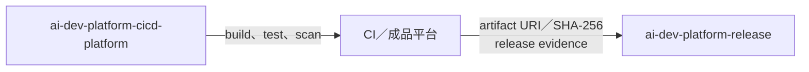

# ai-dev-platform Release

本儲存庫只保存發行中繼資料，不保存產品原始碼或建置成品。



## 允許內容

| 內容 | 位置 |
|---|---|
| 發行證據（release evidence） | `release-evidence/<version>.json` |
| Release Note | `release-notes/<version>.md` |
| 發行標記 | Git tag `v<MAJOR>.<MINOR>.<PATCH>` |
| 成品位置與摘要 | 發行證據內的 `artifact.uri`、`artifact.sha256` |

## 驗證

```bash
python3 ../ai-dev-platform/scripts/verify_release_layout.py .
python3 ../ai-dev-platform/scripts/verify_release_evidence.py release-evidence/<version>.json
```
